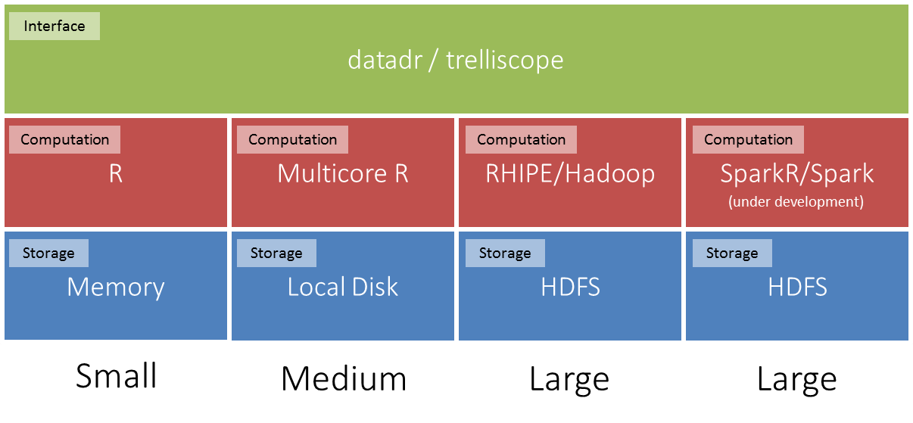
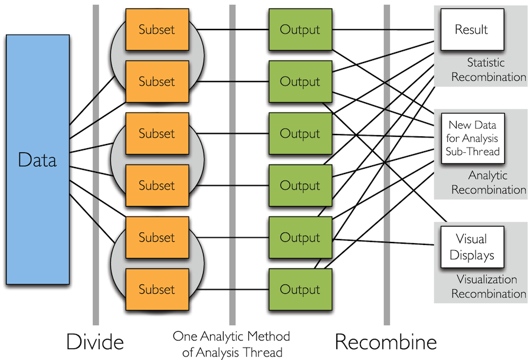
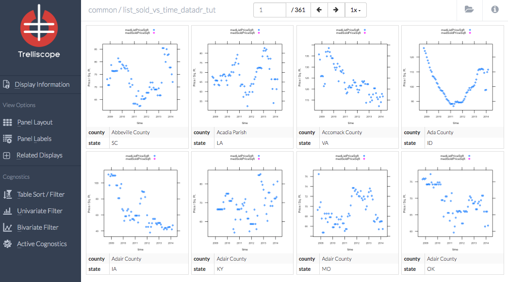
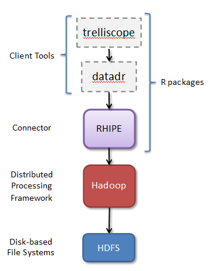
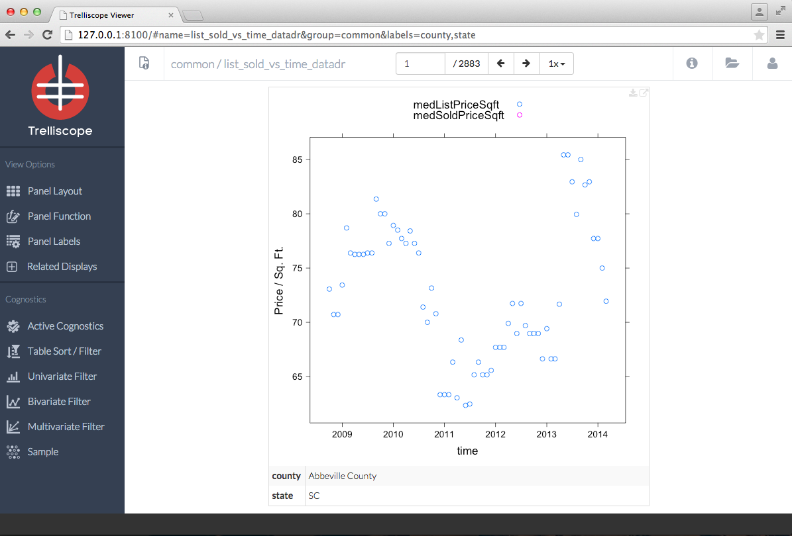
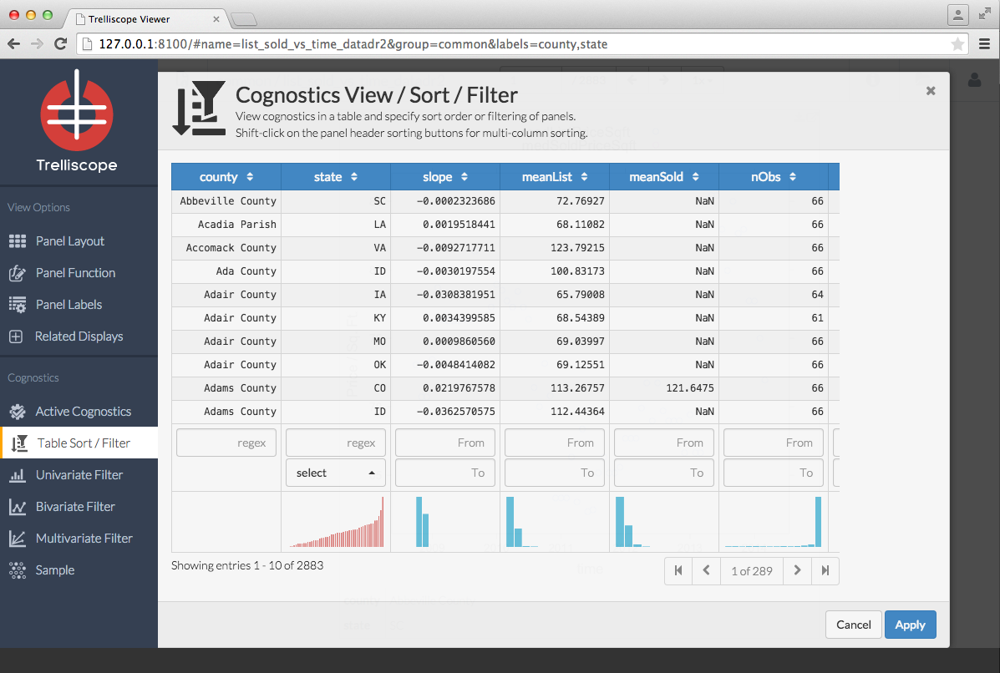

## Tutorial Schedule

| Activity                                  | Time          |
|-------------------------------------------|---------------|
| Tessera overview (Ryan)                   | 13:30 - 14:00 |
| Get started with housing example (Amanda) | 14:00 - 14:30 |
| Break                                     | 10 min        |
| Housing example continued (Amanda)        | 14:40 - 15:30 |
| Break                                     | 10 min        |
| Taxi example (Stephen)                    | 15:40 - 16:30 |

## Installation Check

http://bit.ly/tessera-aalborg

## <span class="underline">Deep Analysis</span> of Large, Complex Data {.smaller}

* Data most often do not come with a model
* If we already (think we) know the algorithm / model to apply and simply apply it to the data and nothing else, we are not doing analysis, we are processing
* Deep analysis means 
    + detailed, comprehensive analysis that does not lose important information in the data
    + learning from the data, not forcing our preconceptions on the data
    + being willing and able to use any of the 1000s of statistical, machine learning, and visualization methods as dictated by the data
    + trial and error, an iterative process of hypothesizing, fitting, validating, learning
    + a lot of visualization

## Deep Analysis of <span class="underline">Large, Complex Data</span>

Large complex data has any or all of the following:

* Large number of records
* Many variables
* Complex data structures not readily put into tabular form of cases by variables
* Intricate patterns and dependencies that require complex models and methods of analysis
* Does not conform to simple assumptions made by many algorithms

## The Goal of Tessera {.smaller}

Provide an environment that allows us to do the following with large complex data:

- Work completely in R
- Have access to R's 1000s of statistical, ML, and vis methods ideally with no need to rewrite scalable versions
- Be able to apply any ad-hoc R code
- Minimize time thinking about code or distributed systems
- Maximize time thinking about the data
- Be able to analyze it with nearly as much flexibility and ease as small data
    
## Tessera Packages

Users interact primarily with two R packages:

- <span class="highlight">datadr</span>: data analysis R package implementing the Divide & Recombine paradigm that allows data scientists to leverage parallel data and processing back-ends such as Hadoop and Spark through a simple consistent interface
- <span class="highlight">Trelliscope</span>: visualization package that enables flexible detailed scalable visualization of large, complex data
    


## Back End Agnostic



<span class="center">Interface stays the same regardless of back end</span>
    
## Tessera Fundamentals: D&R



## Tessera Fundamentals: Trelliscope {.smaller}

* Trelliscope: a viz tool that enables scalable, detailed visualization of large data
* Data is split into meaningful subsets, and a visualization method is applied to each subset
* The user can sort and filter plots based on "cognostics" - summary statistics of interest - to explore the data ([example](https://www.youtube.com/watch?v=KatkJx9Ui0o))



## The Current Tessera Distributed Computing Stack {.smaller}

<table><tr>
<td></td>
<td>
* trelliscope:  visualization of subsets of data, web interface powered by Shiny  http://shiny.rstudio.com
* datadr:  interface for divide and recombine operations
* RHIPE:  The R and Hadoop Integrated Programming Environment 
* Hadoop:  Framework for managing data and computation distributed across multiple hardrives in a cluster
* HDFS:  Hadoop Distributed File System
</td></tr></table>

## More Information

- http://tessera.io
- http://github.com/tesseradata
- [\@TesseraIO](https://twitter.com/TesseraIO)
- [Google user group](https://groups.google.com/forum/#!forum/tessera-users)
- Try it out
    + If you have some applications in mind, give it a try!
    + You don’t need big data or a cluster to use Tessera
    + Ask us for help, give us feedback

# Introduction to `datadr`

## Installing the Tessera packages

```{r eval=FALSE}
install.packages("devtools") # if not installed
library(devtools)
install_github("tesseradata/datadr")
install_github("tesseradata/trelliscope")
install_github("hafen/housingData") # demo data
```

## Housing Data

* Housing sales and listing data in the United States 
* Between 2008-10-01 and 2014-03-01
* Aggregated to the county level 
* Zillow.com data provided by Quandl (https://www.quandl.com/c/housing)

## Housing Data Variables

Variable | Description
---------|-----------------
fips | Federal Information Processing Standard a 5 digit count code
county | US county name
state | US state name
time | date (the data is aggregated monthly)
nSold | number sold this month
medListPriceSqft | median list price per square foot
medSoldPriceSqft | median sold price per square foot

## `datadr` data representation {.smaller}

* Fundamentally, all data types are stored in a back-end as key/value pairs
* Data type abstractions on top of the key/value pairs 
    + Distributed data frame (`ddf`): 
        - A data frame that is split into chunks
        - Each chunk contains a subset of the rows of the data frame
        - Each subset may be distributed across the nodes of a cluster
    + Distributed data object (`ddo`):
        - Similar to distributed data frame
        - Except each chunk can be an object with any structure
        - Every distributed data frame is also a distributed data object

## Back-ends 

`datadr` data back-end options:

* In memory
* Local disk
* HDFS
* Spark (under development)

## Data ingest

```{r eval=FALSE}
# similar to read.table function:
my.data <- drRead.table(
  hdfsConn("/home/me/dir/datafile.txt", header=TRUE, sep="\t")
)

# similar to read.csv function:
my.data2 <- drRead.csv(
    localDiskConn("c:/my/local/data.csv"))

# convert in memory data.frame to ddf:
my.data3 <- ddf(some.data.frame)
```

## You try it

``` {r results='hide', message=FALSE} 
# Load necessary libraries
library(datadr)
library(trelliscope)
library(housingData)

# housing data frame is in the housingData package
housingDdf <- ddf(housing)
```

## Division

* A common thing to do is to divide a dataset based on the value of one or more variables
* Another option is to divide data into random replicates
    + Use random replicates to estimate a GLM fit by applying GLM to each replicate subset and taking the mean coefficients
    + Random replicates can be used for other all-data model fitting approaches like bag of little bootstraps, concensus MCMC, etc.

## Divide example

Divide the housing data set by the variables "county" and "state"

(This kind of data division is very similar to the functionality provided by the plyr package)


``` {r results='hide', message=FALSE}
byCounty <- divide(housingDdf, 
    by = c("county", "state"), update = TRUE)
```

## Divide example

``` {r}
byCounty
```

## Exercise: try the `divide` function

Now try using the divide statement to divide on one or more variables

## Possible solutions

``` {r eval=FALSE}
byState <- divide(housing, by="state", update = TRUE)

byMonth <- divide(housing, by="time", update=TRUE)
```

## Exploring the `ddf` data object

Data divisions can be accessed by index or by key name

```{r}
byCounty[[1]]
```
```{r eval=FALSE}
byCounty[["county=Benton County|state=WA"]]
```

## Exploring the `ddf` data object

Partipants: try these functions on your own

* `summary(byCounty)`
* `names(byCounty)`
* `length(byCounty)`
* `getKeys(byCounty)` 

# Break

## Transformations

* The `addTransform` function applies a function to each key/value pair in a `ddf`
    + E.g. to calculate a summary statistic
* The transformation is not applied immediately, it is deferred until:
    + A function that kicks off a map/reduce job is called (e.g. `recombine`)
    + A subset of the data is requested (e.g. `byCounty[[1]]`)
    + `drPersist` function explicitly forces transformation computation
    
## Transformation example

``` {r} 
# Function to calculate a linear model and extract 
# the slope parameter
lmCoef <- function(x) {
   coef(lm(medListPriceSqft ~ time, data = x))[2]
}

# Best practice tip: test transformation 
# function on one division 
lmCoef(byCounty[[1]]$value)
```
``` {r results='hide', message=FALSE}
# Apply the transform function to the ddf
byCountySlope <- addTransform(byCounty, lmCoef)
```

## Transformation example
```{r}
byCountySlope[[1]]
```

## Exercise: create a transformation function

* Try creating your own transformation function
* Hint: the input to your function will be one value from a key/value pair (e.g. `byCounty[[1]]$value`)

```{r eval=FALSE}
transformFn <- function(x) {
    ## you fill in here
}

# test:
transformFn(byCounty[[1]]$value)

# apply:
xformedData <- addTransform(byCounty, transformFn)
```

## Possible solutions

```{r eval=FALSE}
# example 1
totalSold <- function(x) {
   sum(x$nSold, na.rm=TRUE)
}
byCountySold <- addTransform(byCounty, totalSold)

# example 2
timeRange <- function(x) {
   range(x$time)
}
byCountyTime <- addTransform(byCounty, timeRange)
```

## Recombination

* Combine transformation results together again
* Example

```{r results='hide', message=FALSE}
countySlopes <- recombine(byCountySlope, 
    combine=combRbind)
```
``` {r}
head(countySlopes)
```

## Recombination options

`combine` parameter controls the form of the result

* `combine=combRbind`: `rbind` is used to combine results into `data.frame`, this is the most frequently used option
* `combine=combCollect`: results are collected into a list
* `combine=combDdo`: results are combined into a `ddo` object

## Exercise: try the `recombine` function

* Apply `recombine` to the data with your custom transformation
* Hint: `combine=combRbind` is probably the simplest option

## Exercise: `divide`

Divide two new datasets `geoCounty` and `wikiCounty` by county and state

``` {r eval=FALSE}
# look at the data first
head(geoCounty)
head(wikiCounty)

# use divide function on each
```

## Solution

``` {r results='hide', message=FALSE}
geoByCounty <- divide(geoCounty, 
    by=c("county", "state"))
    
wikiByCounty <- divide(wikiCounty, 
    by=c("county", "state"))
```

## Data operations: drJoin

Join together multiple data objects based on key

```{r rresults='hide', message=FALSE}
joinedData <- drJoin(housing=byCounty, 
    slope=byCountySlope, 
    geo=geoByCounty, 
    wiki=wikiByCounty)
```

## Distributed data objects vs distributed data frames

* In a `ddf` the value in each key/value is always a `data.frame`
* A `ddo` can accomodate values that are not `data.frame`s

```{r}
class(joinedData)
```

## Distributed data objects vs distributed data frames

```{r}
joinedData[[176]]
```

## Data operations: drFilter

Filter a `ddf` or `ddo` based on key and/or value

```{r}
# Note that a few county/state combinations do 
# not have housing sales data:
names(joinedData[[2884]]$value)

# We want to filter those out those
joinedData <- drFilter(joinedData, 
    function(v) {
        !is.null(v$housing)
    })
```

## Other data operations

* `drSample`: returns a `ddo` containing a random sample (i.e. a specified fraction) of key/value pairs
* `drSubset`:  applies a subsetting function to the rows of a `ddf`
* `drLapply`: applies a function to each subset and returns the results in a `ddo`

## Exercise: `datadr` data operations

Apply one or more of these data operations to `joinedData` or a `ddo` or `ddf` you created

* `drJoin`
* `drFilter`
* `drSample`
* `drSubset`
* `drLapply`

## Using Tessera with a Hadoop cluster

Differences from in memory computation:

* Data ingest: use `hdfsConn` to specify a file location to read in HDFS
* Each data object is stored in HDFS
    + Use `output` parameter in most functions to specify a location in HDFS to store data

```{r eval=FALSE}
housing <- drRead.csv(
    file=hdfsConn("/hdfs/data/location"), 
    output=hdfsConn("/hdfs/data/second/location"))

byCounty <- divide(housing, by=c("state", "county"),
    output=hdfsConn("/hdfs/data/byCounty"))
```

# Introduction to `trelliscope`

## Trelliscope

* Divide and recombine visualization tool
* Based on Trellis display
* Apply a visualization method to each subset of a `ddf` or `ddo`
* Interactively sort and filter plots

## Trelliscope panel function

* Define a function to apply to each subset that creates a plot
* Plots can be created using base R graphics, ggplot, lattice, rbokeh, conceptually any htmlwidget

```{r results='hide', message=FALSE}
# Plot medListPriceSqft and medSoldPriceSqft by time
timePanel <- function(x) {
   xyplot(medListPriceSqft + medSoldPriceSqft ~ time,
      data = x$housing, auto.key = TRUE, 
      ylab = "Price / Sq. Ft.")
}
```

## Trelliscope panel function

```{r fig.width=8, fig.height=5}
# test the panel function on one division
timePanel(joinedData[[176]]$value)
```

## Visualization database (vdb)

* Trelliscope creates a directory with all the data to render the plots
* Can later re-launch the Trelliscope display without all the prior data analysis

```{r results='hide', message=FALSE}
vdbConn("housing_vdb", autoYes=TRUE)
```

## Creating a Trelliscope display

```{r results='hide', message=FALSE, eval=FALSE}
makeDisplay(joinedData,
   name = "list_sold_vs_time_datadr",
   desc = "List and sold price over time",
   panelFn = timePanel, 
   width = 400, height = 400, 
   lims = list(x = "same")
)

```
```{r eval=FALSE}
view()
```

## Trelliscope demo



## Exercise: create a panel function

```{r eval=FALSE}
newPanelFn <- function(x) {
   # fill in here
}

# test the panel function
timePanel(joinedData[[1]]$value)

vdbConn("housing_vdb", autoYes=TRUE)

makeDisplay(joinedData,
   name = "panel_test",
   desc = "Your test panel function",
   panelFn = newPaneFn)
```

## Cognostics and display organization

* Cognostic: 
    + a value or summary statistic 
    + calculated on each subset 
    + to help the user focus their attention on plots of interest
* Cognostics are used to sort and filter plots in Trelliscope
* Define a function to apply to each subset to calculate desired values
    + Return a list of named elements
    + Each list element is a single value (no vectors or complex data objects)

## Cognostics function

```{r}
priceCog <- function(x) { 
   st <- getSplitVar(x, "state")
   ct <- getSplitVar(x, "county")
   zillowString <- gsub(" ", "-", paste(ct, st))
   list(
      slope = cog(x$slope, desc = "list price slope"),
      meanList = cogMean(x$housing$medListPriceSqft),
      meanSold = cogMean(x$housing$medSoldPriceSqft),
      lat = cog(x$geo$lat, desc = "county latitude"),
      lon = cog(x$geo$lon, desc = "county longitude"),
      wikiHref = cogHref(x$wiki$href, desc="wiki link"),
      zillowHref = cogHref(
          sprintf("http://www.zillow.com/homes/%s_rb/", 
              zillowString), 
          desc="zillow link")
   )
}
```

## Use the cognostics function in trelliscope

```{r results='hide', message=FALSE, eval=FALSE}
makeDisplay(joinedData,
   name = "list_sold_vs_time_datadr2",
   desc = "List and sold price with cognostics",
   panelFn = timePanel, 
   cogFn = priceCog,
   width = 400, height = 400, 
   lims = list(x = "same")
)
```

## Trelliscope demo



## Exercise: create a cognostics function

```{r eval=FALSE}
newCogFn <- function(x) {
#     list(
#         name1=cog(value1, desc="description")
#     )
}

# test the cognostics function
newCogFn(joinedData[[1]]$value)

makeDisplay(joinedData,
   name = "cognostics_test",
   desc = "Test panel and cognostics function",
   panelFn = newPaneFn,
   cogFn = newCogFn)
view()
```

# Break

# Analysis of NYC Taxi Data

## Data download  

Data and solution for UseR! 2015: http://tessera.io/docs-UseR2015/

- Subset taxi data for New York City  
- First seven days of 2013   
- Ryan has posted some analysis of the NYC taxi data: http://hafen.github.io/taxi/#getting-the-data
- NYC taxi rates are complex: http://www.nyc.gov/html/tlc/html/passenger/taxicab_rate.shtml

## Data Contents {.smaller}

Variable | Description
---------|-----------------
medallion | identifier of the individual taxi's license
hack\_license | taxi driver license id
vendor\_id | unique identifier of taxi owner
rate\_code | code based on type of trip
store\_and\_fwd\_flag | ignore
pickup\_datetime | date and time of trip start
dropoff\_datetime | date and time of trip end
passenger\_count | number of riders
trip\_time\_in\_secs | total time between pickup and dropoff 
trip\_distance | distance covered in miles

## Data Contents {.smaller}

Variable | Description
---------|-----------------
pickup\_longitude, pickup\_latitude | coordinates for start of trip
dropoff\_longitude, dropoff\_latitude | coordinates for end of trip
payment\_type | "CRD" - credit or debit card, "CSH" - cash
fare\_amount | base fare amount
surcharge | additional change for peak hours, certain locations
mta\_tax | local tax
tip\_amount | tip paid, may be $0
tolls\_amount | bridge and tunnel tolls  
total\_amount | total amount paid by passengers 

## Divide and Recombine


## Running a Local Cluster  

- Local cluster can use multiple cores: each running an R process
- R process requires memory for the chunks being processed 
- Buffer size limits number of chunks, but large chunks must be loaded into memory  
Hint: look at arguments of localDiskControl   
Hint: look at process size, ps -aux on Linux or Windows Task Manager
- Local calculations often disk-I/O bound 
- Clusters with HDFS achieve greater I/O bandwidth 


## Challenge Questions

- Compute and plot quantiles of passenger\_count, trip\_time\_in\_secs, trip\_distance, total\_amount, tip\_amount
- Compute summary statistics, such as mean toll or mean tip percent by distance category  
Hint - cut() on divisions of log distance  
Hint - divide the ddf by distance category 
- Explore how tip percent changes with distance category, rate\_code and perhaps hour of the day  
Hint - Think of some potentially useful cognostics
